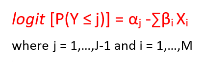

```{r setup, include=FALSE}
library(dplyr)
library(tidyr)
library(ggplot2)
library(gridExtra)
library(MASS)
library(tidyverse)

options(scipen=999)

knitr::opts_chunk$set(echo = TRUE)
```


### 1. INTRODUCTION


#### 1.1. MOBILE APPLICATIONS


Mobile applications (or mobile apps) are computer programs or software applications created to be used on mobile phones, tablets or smartwatches. Originally, they were designed for basic needs like e-mails or calendar. But with the development of mobile devices, there has been an increase in demand for new and life-easing applications such as mobile games, social networking apps, navigation and location-based services. Those applications can be free of charge or can have a price. Mobile applications can be downloaded from distribution platforms like App Store or Google Play Store. 


#### 1.2. RESEARCH OBJECTIVE


The aim of our research is to analyse the big dataset about customers behaviour in terms of downloading the free mobile applications and purchasing the paid ones, find some interesting patterns and detect the factors affecting the number of installs.


#### 1.3. DATASET


The dataset about Google play store apps was downloaded from kaggle.com website (to see the source click [here](https://www.kaggle.com/lava18/google-play-store-apps?fbclid=IwAR0ovxDCXAqDkyunIhSRKqKWRbX5KXnjR33KL_RUroKBwc1dcf5D_h5572A)). 


The dataset before cleaning had almost 11 thousand observations - mobile applications, and 13 variables - Application name, Category, Rating, Reviews, Size, Installs, Type, Price, Content Rating, Genres, Last Updated, Current version, Android version. After cleaning, the dataset remained 9367 observations and 11 variables - we rejected Category and Current version. The procedure of cleaning the data is thoroughly described in the next section.


### 2. DATA ANALYSIS


#### 2.1. CLEANING THE DATA


```{r include=FALSE}
# Importing main data table, NaN are ommited (about 10% of all data)
mainTable <- na.omit(read.csv("data/googleplaystore.csv",header=TRUE))
# Import the ratings, NaN are ommited (about 30% of all data)
ratingsTable <- na.omit(read.csv("data/googleplaystore_user_reviews.csv",header=TRUE))
```

```{r}
# Some basic summary
str(mainTable)
summary(mainTable)
```

```{r}
# Renaming columns
columnsToRename = c('Reviews' = 'Reviews.Count', 'Current.Ver' = 'Current.Software.Version', 'Android.Ver' = 'Android.Version')
mainTable <- mainTable %>% plyr::rename(columnsToRename)
```


```{r}
# FIXING DATA
# All - Setting "Varies with device" as NaN
mainTable[mainTable == "Varies with device"] <- NA
# Rating - Fixing outiliers
mainTable$Rating[mainTable$Rating > 5] <- NA
# Size - Delete M (megabytes)
mainTable[5] <- lapply(mainTable[5], as.character)
mainTable$Size <- substr(mainTable$Size, 1, nchar(mainTable$Size) - 1)
# Type - Fixing the 0
mainTable$Type[mainTable$Type == 0] <- "Free"
# Price - Delete dollars, fix outliers
mainTable$Price <- substring(mainTable$Price,2)
mainTable$Price[mainTable$Price == "" | mainTable$Price == "veryone"] <- "0"
# Content.Rating - Deleting outliers
mainTable$Content.Rating[mainTable$Content.Rating == '' | mainTable$Content.Rating == "Unrated"] <- "Everyone"
# Genres - Taking only the main genre 
mainTable$Genres <- gsub(";.*","",mainTable$Genres)
# Genres - Education and Educational are the same type of apps
mainTable$Genres[mainTable$Genres == "Educational"] <- "Education"
# Last.Updated - Converting to date NOT WORKING YET!
mainTable <- mainTable[!mainTable$Last.Updated == "1.0.19",]
mainTable$Last.Updated <- gsub(",","",mainTable$Last.Updated)
# placeholder <- as.Date(mainTable$Last.Updated, format = "%B %d %Y", optional = TRUE)
# Android.Version - Take only the main part, eg. 4.3
mainTable$Android.Version <- substr(mainTable$Android.Version, 1, 3)
```


```{r}
######DATA TYPES######
# Convert to character
for (i in c(1, 4)){
  mainTable[i] <- lapply(mainTable[i], as.character)
}
# Convert to numeric 
for (i in c(4, 5, 8)){
  mainTable[i] <- lapply(mainTable[i], as.numeric)
}
# Convert to factors
for (i in c(10, 13)){
  mainTable[i] <- lapply(mainTable[i], as.factor)
}
remove(i)
# Drop all unused factors (cool function)
mainTable <- droplevels.data.frame(mainTable)
# Drop the Category column
mainTable <- mainTable[-c(2,12)]
```


#### 2.2. BASIC STATISTICS


```{r}
# Summary
str(mainTable)
summary(mainTable)
# Factors summary
summary(mainTable[c(5,6,8,9,11)])
```


```{r}
# Histograms
p1 <- ggplot(mainTable, aes(x = Rating)) + geom_histogram() 
p2 <- ggplot(mainTable, aes(x = Reviews.Count)) + geom_histogram()
p3 <- ggplot(mainTable, aes(x = Size)) + geom_histogram()
p4 <- ggplot(mainTable, aes(x = Price)) + geom_histogram()
grid.arrange(p1, p2, p3, p4, nrow = 2)
```


```{r}
# Box plots 
p1 <- ggplot(mainTable, aes(y = Rating, 1)) + geom_boxplot() 
p2 <- ggplot(mainTable, aes(y = Reviews.Count, 1)) + geom_boxplot()
p3 <- ggplot(mainTable, aes(y = Size, 1)) + geom_boxplot()
p4 <- ggplot(mainTable, aes(y = Price, 1)) + geom_boxplot()
grid.arrange(p1, p2, p3, p4, nrow = 2)
```


```{r}
# Scatter plots
ggplot(mainTable, aes(y = Reviews.Count, x = seq(1,length(mainTable$Reviews.Count)))) + geom_point()
```


```{r}
head(mainTable)
```


```{r}
pie(table(mainTable$Genres), radius=1)

ggplot(mainTable, aes(x=Genres)) +
       geom_bar( ) + theme(axis.text.x = element_text(angle = 90, hjust = 1))
```


```{r}
ggplot(mainTable, aes(fill=Type, y=1, x=Genres)) + 
    geom_bar( stat="identity", position="fill") + theme(axis.text.x = element_text(angle = 90, hjust = 1))
```


```{r include=FALSE}
######EXPORT CLEAN DATA######
write.csv(mainTable, file = "data/clean_googleplaystore.csv", row.names = FALSE)
write.csv(ratingsTable, file = "data/clean_googleplaystore_user_reviews.csv", row.names = FALSE)
```


#### 2.3. MODELLING


```{r results='hide', message=FALSE, warning=FALSE, include=FALSE}
df_load <- read.csv('data/clean_googleplaystore.csv')
df_selected <- df_load[,c(2,5,6,9)] %>%
                drop_na(.)
```


```{r}
head(df_selected)
summary(df_selected)
```


The distribution of current number of Installs

```{r pressure}
df_selected$Installs <- as.character(df_selected$Installs)
df_selected$Installs <- substr(df_selected$Installs,1,nchar(df_selected$Installs)-1)
df_selected$Installs<- as.numeric(gsub(",", "", df_selected$Installs))
df_selected$Installs <- as.factor(df_selected$Installs)
ggplot(df_selected,aes(Installs))+
  geom_bar()+
  theme(axis.text.x = element_text(angle = 60, hjust = 1))
```


Ordinal Logistic Regression model


Since the number of Installs in this dataset is classified as categorial value, Ordinal Logistic Regression seems to be the most suitable.

```{r}
model_fit <-polr(Installs~Rating+Type+Genres, data = df_selected)
summary(model_fit)
summary_table <- coef(summary(model_fit))
pval <- pnorm(abs(summary_table[, "t value"]),lower.tail = FALSE)* 2
summary_table <- cbind(summary_table, "p value" = round(pval,3))
```


Calculating p value and filtering out those who have p value <= 0.05 or have impact on the model

```{r}
summary_table_filtered <- as_data_frame(summary_table, rownames = 'id')
summary_table_filtered <- summary_table_filtered %>%
                            filter(`p value` <= 0.05)
print.data.frame(summary_table_filtered)
```


Explaining the model


The basic of proportional odds model have mathematical fomulation:
{width=200px}


With 'J' is sum of number of factors in number of Installs (J=18) and 'M' is total number of independent variables (M=3).

'j' is each factor in number of Installs, meanwhile 'i' is each independent variables, simply put: 

* i =1 refers to Rating

* i = 2 refers to Type 

* i = 3 refers to Genres


**Interpretation**:


*Comments on Coefficients*: Only rating of the app have positive effect on number of installs, if the app is paid or belong to these genres below will have negative impact on its number of Installs.


*Comments on intercept*: take 1|5 as example: the odd of log that the app will have only 1 person installs the app versus the odd of log many people (>1) try the app


Apply the model to our case
Suppose again our programer have finished 2 apps with charateristic like belows:


**App 1** have Rating 4 in Genres Educational and a Free app with ads
```{r}
new_app <- data.frame('Rating'=4,'Type'='Free','Genres'='Education')
round(predict(model_fit,new_app,type = "p"), 3)
```


**App 2** is rated at 3.5 and is Racing game with a price.
```{r}
new_app_2 <- data.frame('Rating'=3.5,'Type'='Paid','Genres'='Racing')
round(predict(model_fit,new_app_2,type = "p"), 3)
```


**Results:** The first app may have 20% (highest chance) to get 1 million downloads while the second app has 17% (highest) to get at least 10 thounsand downloads. 


If he/she knows the cost for developing the apps, then he can setup ads rate and setting price level using Expected Value calculation. 


### 3. CONCLUSIONS


### 4. REFERENCES
